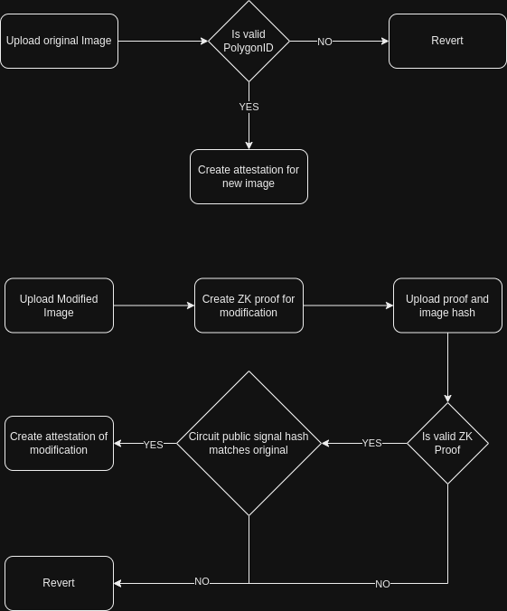

# zKPG

Descentralized audivisual content authenticity validation using zero knowledge proofs, user validation and attestations.

# zKPG

Descentralized audivisual content authenticity validation using zero knowledge proofs, user validation and attestations.

## Content
### Circuits

### Claims
Small golang library to generate the merklized path to the field verified from the claim.

### Contracts
Smart contracts for the ZKPG protocol. Includes the following contracts:
- `z KPG.sol`: Main contract for the protocol. It includes the logic for the creation of the claims, the validation of the claims and the attestation of the claims. Inherits from 
